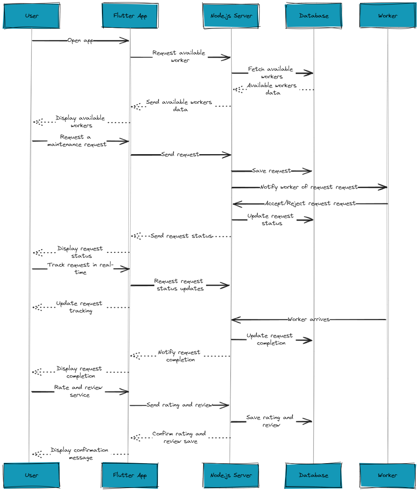

# Fannelance Server

Fannelance is a Flutter and Node.js application that provides maintenance service solutions by connecting clients with the nearest available workers. This server connects the user app and the worker app in the real time using socket.io.

## Table of Contents

- [Installation](#installation)
- [Prerequisites](#prerequisites)
- [Usage](#usage)
- [System Design](#system-design)
- [Documentaion](#fannelance-api-documentation)

## Installation

1. Clone the repository:

   ```sh
   git clone https://github.com/Fannelance/fannelance-server.git
   cd fannelance-server
   ```

2. Install the dependencies:

   ```sh
   npm install
   ```

3. Set up environment variables. Create a `.env` file in the root directory and add the following:
   ```env
   MONGODB_URI = your_mongodb_uri
   JWT_SECRET = your_jwt_secret
   TWILIO_VERIFY_SERVICE_SID = your_twilio_service_sid
   TWILIO_ACCOUNT_SID = your_twilio_account_sid
   TWILIO_AUTH_TOKEN = your_twilio_auth_token
   JWT_SECRET_KEY_USER = your_JWT_user_secret_key
   JWT_SECRET_KEY_WORKER = your_JWT_worker_secret_key
   PORT = 3000
   EMAIL = your_user_email_node_mailer
   EMAIL_PASSWORD = your_user_password_node_mailer
   ```

## Prerequisites

- [Node.js](https://nodejs.org/) (v14 or higher)
- [MongoDB](https://www.mongodb.com/)
- [Twilio Account](https://www.twilio.com/)

## Usage

1. Start the server:

   ```sh
   npm run dev
   ```

2. The server will be running on `http://localhost:3000`.

# System Design

## Reqeust Design

<section id="request" align=center>
  
</section>

# Fannelance API Documentation

## User Endpoints

### 1. Register User

Registers a new user after OTP verification.

- **Endpoint:** `POST /user/register`
- **Description:** Registers a new user after OTP verification.
- **Headers:**
  - `Authorization: Bearer <user-token>`
- **Request Body:**
  ```json
  {
    "firstname": "John",
    "lastname": "Doe",
    "email": "johndoe@example.com",
    "password": "Password123!",
    "gender": "male",
    "location": {
      "latitude": 40.712776,
      "longitude": -74.005974
    }
  }
  ```
- **Response:**
  - **Success:** `200 OK`
    ```json
    {
      "status": true,
      "message": "User created successfully"
    }
    ```
  - **Error:**
    - `400 Bad Request`: Validation error.
      ```json
      {
        "error": "Error message"
      }
      ```
    - `409 Conflict`: User with the same phone number already exists.
      ```json
      {
        "error": "There is already a user with phone number <phone>"
      }
      ```

### 2. Check Phone Number

Checks if a phone number is associated with an existing user.

- **Endpoint:** `POST /user/check-phone`
- **Description:** Checks if a phone number is associated with an existing user.
- **Request Body:**
  ```json
  {
    "phone": "+1234567890"
  }
  ```
- **Response:**
  - **Success:** `200 OK`
    ```json
    {
      "status": true,
      "token": "<generated-token>"
    }
    ```
  - **Error:**
    - `401 Unauthorized`: Phone number not associated with any user.
      ```json
      {
        "status": false,
        "token": "<generated-token>"
      }
      ```

### 3. Login

Verifies user credentials and returns an authentication token.

- **Endpoint:** `POST /user/login`
- **Description:** Verifies user credentials and returns an authentication token.
- **Headers:**
  - `Authorization: Bearer <user-token>`
- **Request Body:**
  ```json
  {
    "password": "Password123!"
  }
  ```
- **Response:**
  - **Success:** `200 OK`
    ```json
    {
      "status": true,
      "token": "<generated-token>"
    }
    ```
  - **Error:**
    - `401 Unauthorized`: Incorrect password.
      ```json
      {
        "error": "Incorrect password"
      }
      ```
    - `404 Not Found`: User not found.
      ```json
      {
        "error": "User not found"
      }
      ```

### 4. Get User Data

Retrieves authenticated user's data.

- **Endpoint:** `GET /user`
- **Description:** Retrieves authenticated user's data.
- **Headers:**
  - `Authorization: Bearer <user-token>`
- **Response:**
  - **Success:** `200 OK`
    ```json
    {
      "status": true,
      "data": {
        "firstname": "John",
        "lastname": "Doe",
        "email": "johndoe@example.com",
        ...
      }
    }
    ```
  - **Error:**
    - `401 Unauthorized`: User not authorized.
      ```json
      {
        "error": "User not authorized"
      }
      ```
    - `404 Not Found`: User not found.
      ```json
      {
        "error": "User not found"
      }
      ```

### 5. Update Location

Updates the user's location.

- **Endpoint:** `PUT /user/update-location`
- **Description:** Updates the user's location.
- **Headers:**
  - `Authorization: Bearer <user-token>`
- **Request Body:**
  ```json
  {
    "latitude": 40.712776,
    "longitude": -74.005974
  }
  ```
- **Response:**
  - **Success:** `200 OK`
    ```json
    {
      "message": "Location updated successfully"
    }
    ```
  - **Error:**
    - `401 Unauthorized`: User not authorized.
      ```json
      {
        "error": "User not authorized"
      }
      ```
    - `404 Not Found`: User not found.
      ```json
      {
        "error": "User not found"
      }
      ```

### 6. Update Password

Updates the user's password.

- **Endpoint:** `PUT /user/update-password`
- **Description:** Updates the user's password.
- **Headers:**
  - `Authorization: Bearer <user-token>`
- **Request Body:**
  ```json
  {
    "oldpassword": "OldPassword123!",
    "newpassword": "NewPassword123!",
    "repeatedpassword": "NewPassword123!"
  }
  ```
- **Response:**
  - **Success:** `200 OK`
    ```json
    {
      "status": true,
      "message": "Password updated successfully"
    }
    ```
  - **Error:**
    - `401 Unauthorized`: Incorrect old password or user not authorized.
      ```json
      {
        "error": "Incorrect password."
      }
      ```
    - `400 Bad Request`: New passwords do not match or are invalid.
      ```json
      {
        "error": "Passwords do not match"
      }
      ```
    - `404 Not Found`: User not found.
      ```json
      {
        "error": "User not found"
      }
      ```

### 7. Reset Password

Resets the user's password.

- **Endpoint:** `PUT /user/reset-password`
- **Description:** Resets the user's password.
- **Headers:**
  - `Authorization: Bearer <user-token>`
- **Request Body:**
  ```json
  {
    "newpassword": "NewPassword123!",
    "repeatedpassword": "NewPassword123!"
  }
  ```
- **Response:**
  - **Success:** `200 OK`
    ```json
    {
      "status": true,
      "token": "<generated-token>"
    }
    ```
  - **Error:**
    - `400 Bad Request`: New passwords do not match or are invalid.
      ```json
      {
        "error": "Passwords do not match"
      }
      ```
    - `404 Not Found`: User not found.
      ```json
      {
        "error": "User not found"
      }
      ```

### 8. Delete User Account

Deletes the authenticated user's account.

- **Endpoint:** `DELETE /user/delete-account`
- **Description:** Deletes the authenticated user's account.
- **Headers:**
  - `Authorization: Bearer <user-token>`
- **Response:**
  - **Success:** `200 OK`
    ```json
    {
      "status": true,
      "data": "<deleted-user-data>"
    }
    ```
  - **Error:**
    - `401 Unauthorized`: User not authorized.
      ```json
      {
        "error": "User not authorized"
      }
      ```
    - `404 Not Found`: User not found.
      ```json
      {
        "error": "User not found"
      }
      ```

### 9. Get User Requests

Retrieves the list of service requests made by the user.

- **Endpoint:** `GET /user/requests`
- **Description:** Retrieves the list of service requests made by the user.
- **Headers:**
  - `Authorization: Bearer <user-token>`
- **Response:**
  - **Success:** `200 OK`
    ```json
    {
      "status": true,
      "data": [
        {
          "_id": "worker-id",
          "firstname": "WorkerFirstName",
          "lastname": "WorkerLastName",
          "phone": "+1234567890",
          "email": "worker@example.com",
          "jobTitle": "Electrician",
          "gender": "male",
          "rate": 4.5,
          "price": 100,
          "request_date": "2024-08-16"
        },
        ...
      ]
    }
    ```
  - **Error:**
    - `500 Internal Server Error`: Server error.
      ```json
      {
        "error": "Server error"
      }
      ```

### 10. Find Suitable Workers

Finds suitable workers based on the user's location and service request.

- **Endpoint:** `GET /close-workers`
- **Description:** Finds suitable workers based on the user's location and service request.
- **Headers:**
  - `Authorization: Bearer <user-token>`
- **Response:**
  - **Success:** `200 OK`
    ```json
    {
      "status": true,
      "data": [
        {
          "_id": "worker-id",
          "firstname": "WorkerFirstName",
          "lastname": "WorkerLastName",
          ...
        },
        ...
      ]
    }
    ```
  - **Error:**
    - `500 Internal Server Error`: Server error.
      ```json
      {
        "error": "Server error"
      }
      ```

## Worker Endpoints

### 1. Worker Registration

Registers a new worker.

- **URL:** `/worker/register`
- **Method:** `POST`
- **Headers:**
  - `Authorization: Bearer token`
- **Request Body:**
  ```json
  {
    "firstname": "John",
    "lastname": "Doe",
    "password": "Password123!",
    "email": "john.doe@example.com",
    "gender": "male",
    "location": {
      "latitude": 40.712776,
      "longitude": -74.005974
    },
    "jobTitle": "Plumber",
    "price": 50
  }
  ```
- **Response:**
  - **Success:** `200 OK`
    ```json
    {
      "status": true,
      "message": "Worker registered successfully"
    }
    ```
  - **Error:**
    - `400 Bad Request`: Missing or invalid fields
    - `409 Conflict`: Worker already exists

## 2. Check Worker Phone

Checks if a worker's phone number is already registered.

- **URL:** `/worker/check-phone`
- **Method:** `POST`
- **Request Body:**
  ```json
  {
    "phone": "1234567890"
  }
  ```
- **Response:**
  - **Success:** `200 OK`
    ```json
    {
      "status": true,
      "token": "jwt-token"
    }
    ```
  - **Error:**
    - `400 Bad Request`: Missing phone number
    - `401 Unauthorized`: Phone number not registered

## 3. Worker Login

Authenticates a worker using their phone number and password.

- **URL:** `/worker/login`
- **Method:** `POST`
- **Headers:**
  - `Authorization: Bearer token`
- **Request Body:**
  ```json
  {
    "password": "Password123!"
  }
  ```
- **Response:**
  - **Success:** `200 OK`
    ```json
    {
      "status": true,
      "token": "jwt-token"
    }
    ```
  - **Error:**
    - `401 Unauthorized`: Incorrect password
    - `404 Not Found`: Worker not found

## 4. Get Worker Data

Retrieves the worker's data.

- **URL:** `/worker/data`
- **Method:** `GET`
- **Headers:**
  - `Authorization: Bearer token`
- **Response:**
  - **Success:** `200 OK`
    ```json
    {
      "status": true,
      "data": {
        "firstname": "John",
        "lastname": "Doe",
        "phone": "1234567890",
        "email": "john.doe@example.com",
        "gender": "male",
        "location": "New York",
        "jobTitle": "Plumber",
        "price": 50
      }
    }
    ```
  - **Error:**
    - `404 Not Found`: Worker not found
    - `401 Unauthorized`: Unauthorized access

## 5. Update Location

Updates the worker's current location.

- **URL:** `/worker/update-location`
- **Method:** `PUT`
- **Headers:**
  - `Authorization: Bearer token`
- **Request Body:**
  ```json
  {
    "latitude": "40.7128",
    "longitude": "-74.0060"
  }
  ```
- **Response:**
  - **Success:** `200 OK`
    ```json
    {
      "message": "Location updated successfully"
    }
    ```
  - **Error:**
    - `404 Not Found`: Worker not found
    - `401 Unauthorized`: Unauthorized access

## 6. Update Password

Updates the worker's password.

- **URL:** `/worker/update-password`
- **Method:** `PUT`
- **Headers:**
  - `Authorization: Bearer token`
- **Request Body:**
  ```json
  {
    "oldpassword": "OldPassword123!",
    "newpassword": "NewPassword123!",
    "repeatedpassword": "NewPassword123!"
  }
  ```
- **Response:**
  - **Success:** `200 OK`
    ```json
    {
      "status": true,
      "message": "Password updated successfully"
    }
    ```
  - **Error:**
    - `404 Not Found`: Worker not found
    - `401 Unauthorized`: Incorrect old password or unauthorized access
    - `400 Bad Request`: Passwords do not match or are invalid

## 7. Reset Password

Resets the worker's password.

- **URL:** `/worker/reset-password`
- **Method:** `PUT`
- **Headers:**
  - `Authorization: Bearer token`
- **Request Body:**
  ```json
  {
    "newpassword": "NewPassword123!",
    "repeatedpassword": "NewPassword123!"
  }
  ```
- **Response:**
  - **Success:** `200 OK`
    ```json
    {
      "status": true,
      "message": "Password has been reset successfully"
    }
    ```
  - **Error:**
    - `404 Not Found`: Worker not found
    - `400 Bad Request`: Passwords do not match or are invalid

## 8. Delete Worker Account

Deletes the worker's account.

- **URL:** `/worker/delete-account`
- **Method:** `DELETE`
- **Headers:**
  - `Authorization: Bearer token`
- **Response:**
  - **Success:** `200 OK`
    ```json
    {
      "status": true,
      "message": "Account deleted successfully"
    }
    ```
  - **Error:**
    - `404 Not Found`: Worker not found
    - `401 Unauthorized`: Unauthorized access

## 9. Get Worker Requests

Fetches all requests assigned to the worker.

- **URL:** `/worker/requests`
- **Method:** `GET`
- **Headers:**
  - `Authorization: Bearer token`
- **Response:**
  - **Success:** `200 OK`
    ```json
    {
      "status": true,
      "data": [
        {
          "_id": "123",
          "firstname": "Jane",
          "lastname": "Doe",
          "phone": "0987654321",
          "email": "jane.doe@example.com",
          "gender": "female",
          "request_date": "2024-08-16T08:00:00Z"
        }
      ]
    }
    ```
  - **Error:**
    - `500 Internal Server Error`: Server error

## 10. Get Wallet Balance

Retrieves the worker's wallet balance.

- **URL:** `/worker/wallet`
- **Method:** `GET`
- **Headers:**
  - `Authorization: Bearer token`
- **Response:**
  - **Success:** `200 OK`
    ```json
    {
      "status": true,
      "data": 100
    }
    ```
  - **Error:**
    - `404 Not Found`: Worker not found
    - `500 Internal Server Error`: Server error

## 11. Deposit to Wallet

Deposits a specified amount to the worker's wallet.

- **URL:** `/worker/deposite`
- **Method:** `PUT`
- **Headers:**
  - `Authorization: Bearer token`
- **Request Body:**
  ```json
  {
    "amount": 50
  }
  ```
- **Response:**
  - **Success:** `200 OK`
    ```json
    {
      "status": true,
      "message": "Amount deposited successfully"
    }
    ```
  - **Error:**
    - `404 Not Found`: Worker not found
    - `500 Internal Server Error`: Server error

## Authentication

All requests to protected endpoints require a Bearer token for authentication. The token should be included in the Authorization header.

```bash
Authorization: Bearer <your-token-here>
```

## Error Handling

Common error responses include:

- `400 Bad Request`: The request was malformed or missing required fields.
- `401 Unauthorized`: The request requires authentication or failed authentication.
- `404 Not Found`: The requested resource was not found.
- `409 Conflict`: Conflict with existing resource (e.g., duplicate registration).
- `500 Internal Server Error`: An unexpected error occurred on the server.

## Notes

- Passwords should be validated against the defined criteria for security.
- Location updates require latitude and longitude to be provided as coordinates.
- Availability changes will be broadcasted to connected clients via WebSocket.

This documentation provides an overview of the available endpoints, their expected inputs, and outputs. Use this guide to integrate with the user and Worker API effectively.
